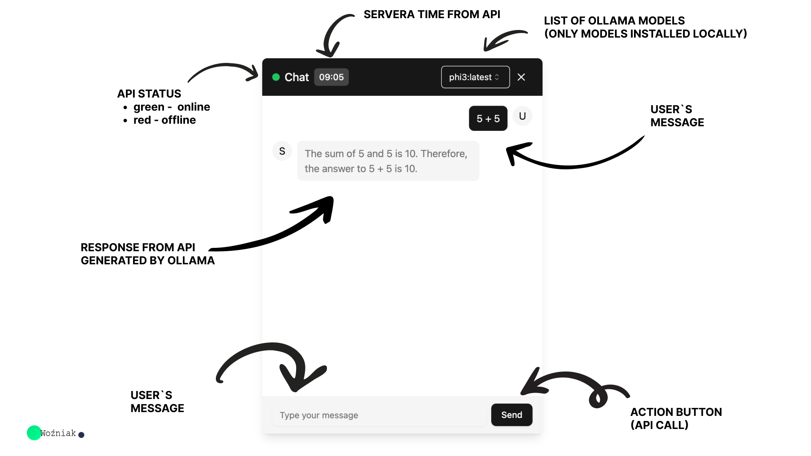
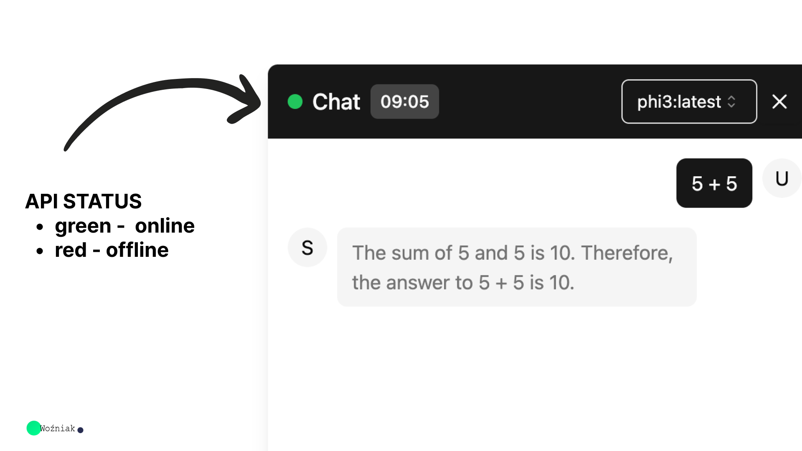
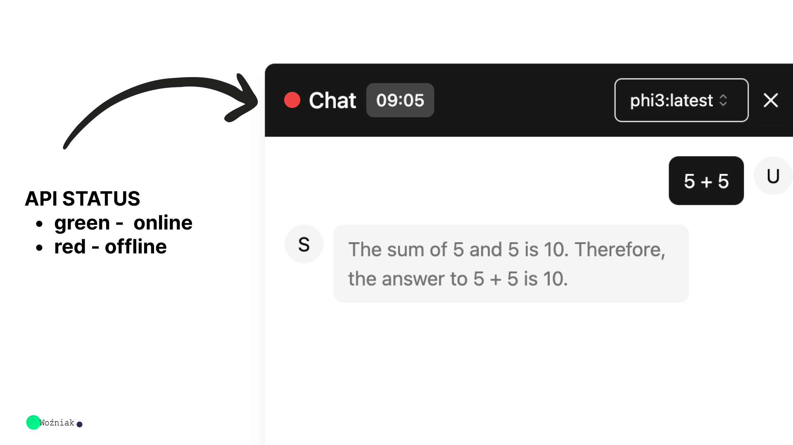
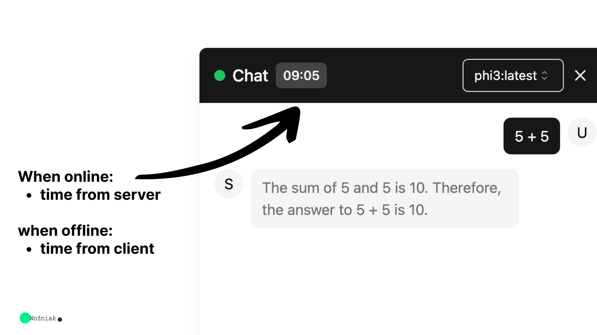
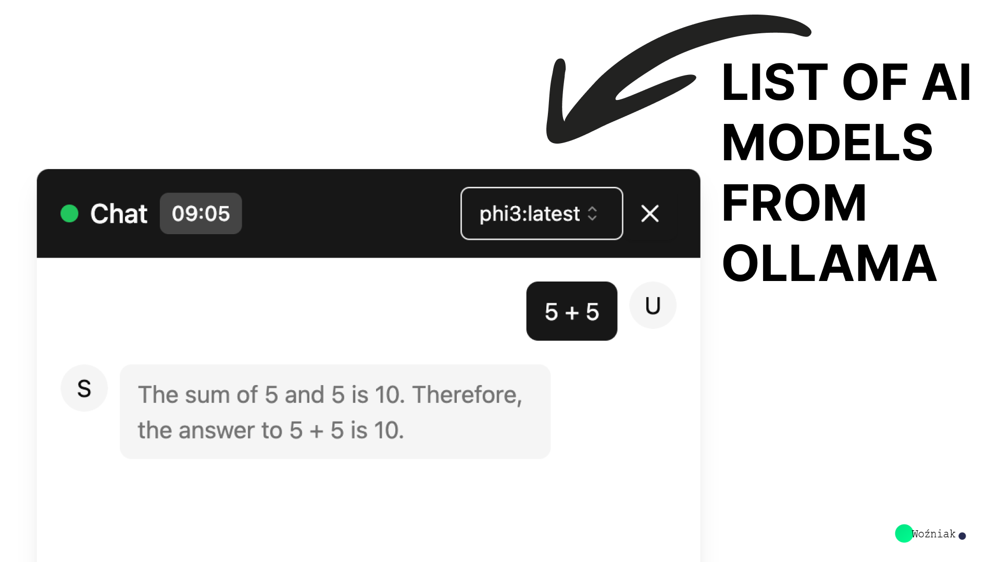
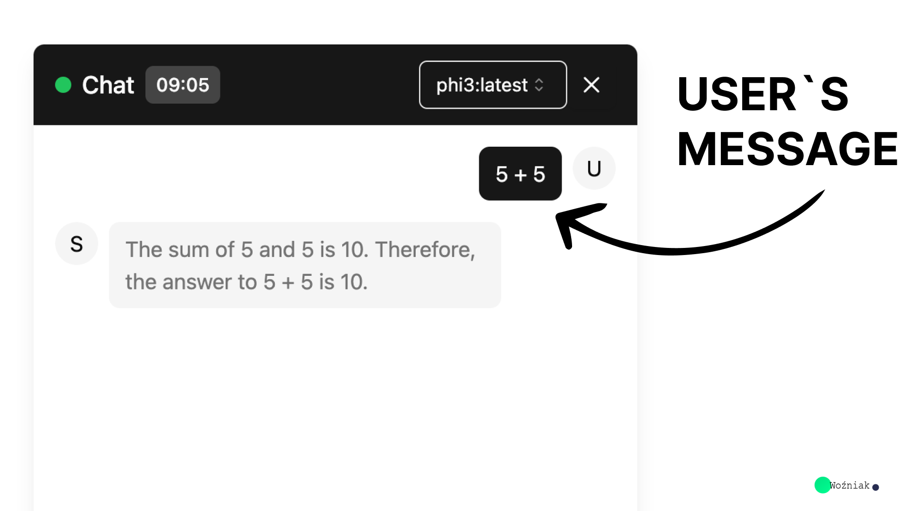
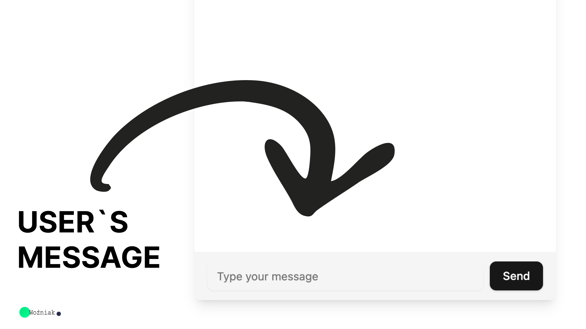
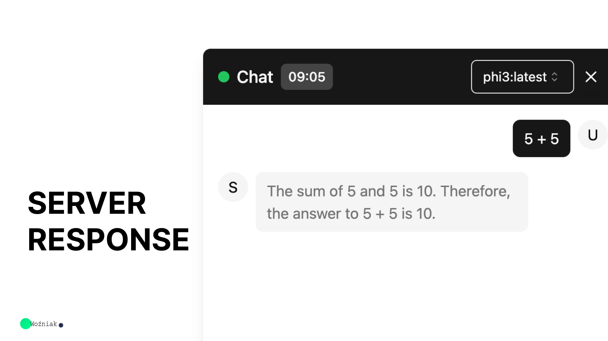

🤖 NexaChat WebAI

A modern, responsive, and feature-rich web interface for interacting with AI models through Ollama and Google Gemini.

NexaChat WebAI combines a modern React frontend with a NestJS backend to provide a clean and flexible AI chat experience. The application supports local AI models through Ollama as well as cloud-based AI through Google Gemini.

The project includes conversation management, persistent chat history, AI model selection, light and dark themes, API availability monitoring, loading states, error handling, and a responsive interface designed for both desktop and mobile devices.



---

✨ Features

🤖 AI Integration

- 🦙 Local AI model integration through Ollama
- 🧠 Google Gemini AI integration
- 🧩 AI model selection
- 💬 Interactive AI conversations
- 🔄 Frontend and backend API communication
- ⚡ Fast development experience with Vite

💬 Conversation Management

- 🆕 Create new conversations
- 💾 Persistent conversation history
- 🔄 Switch between conversations
- 🗑️ Delete conversations
- 🧹 Clear the current conversation
- 📝 Conversation titles
- 🔢 Message count for each conversation
- 💿 Local browser storage using "localStorage"

🎨 User Interface

- 🌙 Dark mode
- ☀️ Light mode
- 📱 Responsive design
- 💻 Desktop-friendly interface
- 📲 Mobile-friendly interface
- 🟢 API online/offline status
- ⏱️ Connection/status timer
- 📋 Copy AI responses
- ⏳ Loading indicators
- ⚠️ Error handling
- 🔽 Scrollable conversation history
- 🎯 Clean and modern chat interface

🔧 Backend

- 🚀 NestJS REST API
- 🧠 Gemini integration
- 🦙 Ollama integration
- 📚 Swagger API documentation
- 🔌 Modular backend architecture
- 🌐 Frontend/backend separation
- 🛡️ Error handling and API status monitoring

---

## 🧰 Technologies Used

| Technology | Purpose |
|---|---|
| React | Frontend UI |
| TypeScript | Type-safe development |
| Vite | Frontend development and build system |
| Tailwind CSS | Responsive UI styling |
| shadcn/ui | Reusable UI components |
| NestJS | Backend API framework |
| Node.js | Backend runtime |
| npm | Package management |
| Ollama | Local AI model runtime |
| REST API | Frontend ↔ Backend communication |
| LocalStorage | Client-side persistence |
| Swagger | API documentation |
---

🏗️ Application Architecture
```
                         ┌───────────────────────┐
                         │        User Browser       │
                         │     Desktop / Mobile      │
                         └───────────┬───────────┘
                                       │
                                       ▼
                         ┌───────────────────────┐
                         │     NexaChat WebAI        │
                         │         Frontend          │
                         │   React + TypeScript      │
                         │          + Vite           │
                         └───────────┬───────────┘
                                       │
                                    REST API
                                       │
                                       ▼
                         ┌───────────────────────┐
                         │        NestJS API         │
                         │          Backend          │
                         └───────────┬───────────┘
                                       │
                          ┌──────────┴──────────┐
                          │                         │
                          ▼                        ▼
                 ┌─────────────────┐   ┌─────────────────┐
                 │        Ollama      │   │    Google Gemini   │
                 │     Local Models   │   │      Cloud AI      │
                 └─────────────────┘   └─────────────────┘

```
---

📋 Table of Contents

1. "Prerequisites" (#prerequisites)
2. "Installation" (#installation)
   - "API Installation" (#api-installation)
   - "Frontend Installation" (#frontend-installation)
3. "AI Configuration" (#ai-configuration)
   - "Ollama" (#ollama)
   - "Google Gemini" (#google-gemini)
4. "Running the Project" (#running-the-project)
   - "Running the API" (#running-the-api)
   - "Running the Frontend" (#running-the-frontend)
5. "Project Features" (#project-features)
6. "Responsive Design" (#responsive-design)
7. "Local Network Access" (#local-network-access)
8. "Cloudflare Tunnel" (#cloudflare-tunnel)
9. "Production Build" (#production-build)
10. "Project Structure" (#project-structure)
11. "Screenshots" (#screenshots)
12. "Troubleshooting" (#troubleshooting)
13. "Security" (#security)
14. "Project Status" (#project-status)
15. "Author" (#author)

---

📋 Prerequisites

Ensure you have the following installed on your machine:

- "Node.js" (https://nodejs.org/) (v14 or higher)
- "npm" (https://www.npmjs.com/) (v6 or higher)
- "Ollama" (https://ollama.com/) for local AI models
- Google Gemini API key if Gemini is enabled
- Git

---
## 💾 Local Persistence

| Stored Data | Purpose |
|---|---|
| Chat History | Preserve conversations |
| Active Conversation | Restore the selected conversation |
| Theme | Remember Light/Dark mode preference |

---

🚀 Installation

API Installation

Navigate to the API directory:

cd api

Install the backend dependencies:

npm install

Or using Yarn:

yarn install

---

Frontend Installation

Navigate to the frontend directory:

cd ../frontend

Install the frontend dependencies:

npm install

Or using Yarn:

yarn install

---

🧠 AI Configuration

🦙 Ollama

NexaChat WebAI supports local AI models through Ollama.

Start the Ollama service:

ollama serve

Download an AI model:

ollama pull llama3

Check installed models:

ollama list

You can use other compatible Ollama models depending on your system.

Ollama allows NexaChat WebAI to communicate with locally running AI models without requiring every conversation to be processed by a cloud AI service.

---

🧠 Google Gemini

NexaChat WebAI also supports Google Gemini through the backend API.

Configure your Gemini API credentials according to the backend configuration.

Example environment variable:

GEMINI_API_KEY=your_api_key_here

Keep your API key private.

Never commit real API keys or secrets to GitHub.

---

## 💬 Chat Features

| Feature | Description |
|---|---|
| New Chat | Creates a new conversation |
| Send Message | Sends a message to the backend |
| Model Selector | Selects an available AI model |
| Chat History | Displays previous conversations |
| Delete Chat | Deletes a selected conversation |
| Clear Chat | Clears the current conversation |
| Dark Mode | Enables dark interface |
| Light Mode | Enables light interface |
| API Status | Shows backend availability |
| Loading State | Indicates that a response is being processed |
| Error Modal | Displays API or application errors |

---
## 📱 Responsive Design

| Device | Supported |
|---|---|
| Desktop | ✅ |
| Laptop | ✅ |
| Tablet | ✅ |
| Android Phone | ✅ |
| Mobile Browser | ✅ |

---
▶️ Running the Project

NexaChat WebAI consists of two main services:

Frontend → http://localhost:5173
Backend  → http://localhost:7010

Both services should be running for the complete application experience.

---

## 🚀 Running the Project

| Service | Port | Technology |
|---|---:|---|
| Backend API | `7010` | NestJS |
| Frontend | `5173` | Vite |
| Alternative Frontend Port | `5174` | Vite |

---

🔵 Running the API

Navigate to the API directory:

cd api

Start the development server:

npm run start:dev

Or with Yarn:

yarn start:dev

The API server should now be available at:

http://localhost:7010

---

📚 Swagger API Documentation

Swagger documentation is available at:

http://localhost:7010/api

Swagger can be used to inspect and test the available API endpoints.

---

🟢 Running the Frontend

Open another terminal and navigate to the frontend:

cd frontend

Start Vite:

npm run dev

Or:

yarn dev

The frontend normally runs at:

http://localhost:5173

If port "5173" is already in use, Vite automatically selects another available port, such as:

http://localhost:5174

Always use the URL displayed by Vite.

---

# 🖥️ Project Features

The following screenshots demonstrate the main NexaChat WebAI interface and functionality.

# 🟢 API Online Status



# 🔴 API Offline Status


# ⏱️ Connection Time



# 🧩 AI Model Selection



# 💬 User Message



# ⌨️ Message Input



# 🤖 AI Server Response



---

📱 Responsive Design

NexaChat WebAI is designed to work across different screen sizes.

The interface is intended to provide a consistent experience on:

- 💻 Desktop computers
- 💻 Laptops
- 📱 Android devices
- 📱 Mobile browsers
- 📲 Other modern browsers

The frontend uses responsive layouts so that the chat interface, conversation sidebar, message area, controls, and input section can adapt to different screen sizes.

---

🌐 Local Network Access

The frontend can be exposed to other devices connected to the same local network.

Start Vite with:

npm run dev -- --host 0.0.0.0

Vite will display a network address similar to:

http://192.168.x.x:5173

Open that address from another device connected to the same network.

Make sure the backend API is also reachable from the device if the application requires direct network communication with the API.

---

☁️ Cloudflare Tunnel

For remote testing, NexaChat WebAI can be exposed through Cloudflare Tunnel.

For a temporary tunnel:

cloudflared tunnel --url http://127.0.0.1:5173

Cloudflare will provide a temporary public URL.

For example:

https://example.trycloudflare.com

For production usage, a properly configured Cloudflare Tunnel and domain should be used.

---

🏗️ Production Build

To build the frontend for production:

cd frontend
npm run build

The generated production files will be placed inside:

frontend/dist

The build process uses TypeScript and Vite to generate the optimized frontend assets.

---

📂 Project Structure

The project is divided into two main parts:

- api — Backend API
- frontend — Web interface
```
NexaChat-WebAI/
│
├── api/
│   ├── src/
│   │   ├── chatgpt/
│   │   ├── gemini/
│   │   ├── ...
│   │   ├── app.module.ts
│   │   └── main.ts
│   │
│   ├── dist/
│   ├── test/
│   ├── package.json
│   ├── package-lock.json
│   └── tsconfig.json
│
├── frontend/
│   ├── public/
│   ├── src/
│   │   ├── components/
│   │   ├── hooks/
│   │   ├── App.tsx
│   │   ├── App.css
│   │   ├── index.css
│   │   └── main.tsx
│   │
│   ├── package.json
│   ├── package-lock.json
│   ├── tsconfig.json
│   └── vite.config.ts
│
├── docs/
│   ├── hero.png
│   ├── status-online.png
│   ├── status-offline.png
│   ├── time.png
│   ├── list-of-all-ai-models.png
│   ├── users-message.png
│   ├── users-message-input-field.png
│   └── server-response.png
│
└── README.md
```
---

💾 Conversation Storage

NexaChat WebAI stores conversation information locally in the browser.

The application uses browser "localStorage" to maintain conversation data, allowing conversations to remain available after refreshing the page in the same browser.

Conversation management includes:

- Creating conversations
- Selecting conversations
- Deleting conversations
- Clearing the current conversation
- Maintaining message history
- Maintaining conversation titles
- Tracking message counts

---

🔧 API Architecture

The backend is built using NestJS and provides the API layer between the frontend and AI services.

The API is responsible for:

- Receiving chat requests
- Communicating with AI providers
- Processing AI responses
- Providing model information
- Monitoring backend availability
- Managing AI provider integrations
- Providing Swagger API documentation

---

🧩 Frontend Architecture

The frontend is built with React and TypeScript using Vite.

Main frontend responsibilities include:

- Rendering the chat interface
- Managing application state
- Displaying conversations
- Selecting AI models
- Sending user messages
- Displaying AI responses
- Managing themes
- Monitoring API availability
- Handling loading and error states
- Providing responsive layouts

---

🛠️ Troubleshooting

"vite: not found"

If you receive:

vite: not found

Install the frontend dependencies:

cd frontend
npm install

Then run:

npm run dev

---

Port 5173 is already in use

If Vite reports:

Port 5173 is in use

Vite may automatically select another port:

5174

Use the URL shown in the terminal.

---

Blank / White Page

If the browser displays a blank page:

First verify that the frontend builds successfully:

cd frontend
npm run build

Then check the browser developer console for JavaScript runtime errors.

Also verify that the API backend is running:

cd api
npm run start:dev

---

API Connection Problems

Verify that the backend is running:

cd api
npm run start:dev

Then check:

http://localhost:7010

Swagger:

http://localhost:7010/api

---

Ollama Problems

Make sure Ollama is running:

ollama serve

Check installed models:

ollama list

If the required model is missing:

ollama pull llama3

---

Reinstall Dependencies

If dependency problems occur, reinstall the packages.

Backend

cd api
rm -rf node_modules package-lock.json
npm install

Frontend

cd ../frontend
rm -rf node_modules package-lock.json
npm install

---

🔐 Security

Never commit sensitive information to GitHub.

Do not expose or commit:

- API keys
- Passwords
- Access tokens
- Private credentials
- ".env" files containing secrets
- Cloudflare credentials

Use environment variables for sensitive configuration.

---

📌 Project Status

NexaChat WebAI is an active AI web application project.

The current application provides:

- Ollama AI integration
- Google Gemini integration
- AI model selection
- Conversation management
- Persistent chat history
- Light and dark themes
- API status monitoring
- Loading states
- Error handling
- Responsive interface
- NestJS backend
- React frontend
- Swagger API documentation

The project is continuously developed and can be extended with additional AI providers and features.

---

🚀 Future Development

Possible future improvements include:

- 🔐 User authentication
- 👤 User accounts
- ☁️ Cloud conversation synchronization
- 📎 File uploads
- 🖼️ Image processing
- 🎙️ Voice interaction
- 💬 Advanced conversation management
- ⚙️ User settings
- 📊 Usage statistics
- 🔒 Advanced security
- 🌍 Production deployment
- 🧠 Additional AI providers
- 📱 Progressive Web App support

---

👨‍💻 Author

Eng\ Mohammed Najeeb Abdulrazzaq Al-Sabai 

GitHub:

https://github.com/alsabai2004

---

⭐ Support

If you find NexaChat WebAI useful, consider supporting the project by:

- ⭐ Starring the repository
- 🐛 Reporting issues
- 💡 Suggesting improvements
- 🔧 Contributing to the project

---

📄 License

This project is intended for educational and development purposes.

---

NexaChat WebAI — Modern AI conversations powered by Ollama and Gemini. 🤖

---

